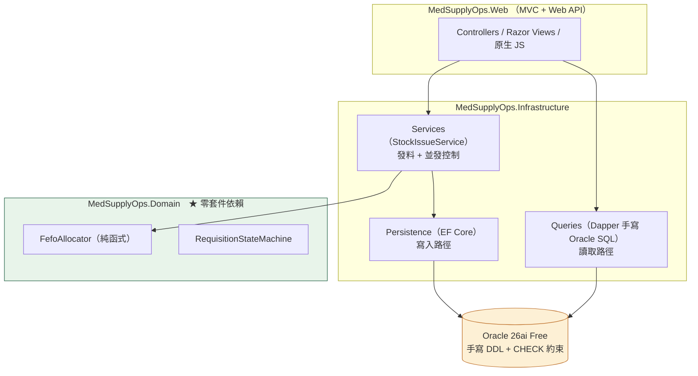

# MedSupplyOps

醫材耗材的**請領與庫存管理系統**。C# / ASP.NET Core MVC + Web API / Oracle。

---

## 這份 README 想回答的問題

不是「用了哪些技術」，而是 —— **你怎麼知道它是對的？**

因為這個系統裡最危險的錯誤，全部都**不會當機、不會報錯、畫面完全正常**：

| 如果這裡寫錯 | 使用者會看到什麼 |
|---|---|
| 效期發料的順序反了 | 數量正確、庫存扣得剛好、頁面毫無異狀 —— 只是發出去的是快過期的那批 |
| 過期判定差一天（`<` 寫成 `<=`） | 每批醫材少用一天。沒有任何人會回報 |
| 兩人同時領最後一箱 | 兩張單都成功、庫存變成 -5 |
| 請領單的非法狀態轉換被靜默忽略 | 使用者按了核准、沒有錯誤訊息、單子還停在原狀態 |
| ER 圖與實際 schema 脫節 | 圖畫得漂漂亮亮，只是它已經是錯的 |

「跑起來看看」抓不到上面任何一項。所以這個專案的重點不在功能數量，
在於**為每一條這樣的規則，設計一個能區分對錯的驗證**。

---

## 我如何確認它是對的

### 1. 六道關卡，每次提交都全跑

```bash
dotnet build MedSupplyOps.slnx --nologo                                    # 編譯 + 型別檢查 + 分析器（警告即錯誤）
dotnet test  MedSupplyOps.slnx --nologo                                    # 116 條測試
dotnet format MedSupplyOps.slnx --verify-no-changes --verbosity minimal    # 格式與命名
powershell -File scripts/mutation-probe.ps1                                # ★ 鑑別力探針
powershell -File scripts/generate-er-diagram.ps1 -Check                    # ★ ER 圖漂移檢查
powershell -File scripts/check-db-clean.ps1                                # ★ 測試沒在資料庫留下殘留
```

前三道是常見的。**後三道是這個專案的重點。**

### 2. ★ 鑑別力探針：證明測試真的測得到

> **不能區分「修前」與「修後」的驗證，等於沒有驗證。**

測試全綠只代表「測試沒有失敗」，**不代表「測試測得到那件事」**。
所以 [`scripts/mutation-probe.ps1`](scripts/mutation-probe.ps1) 會自動把實作**故意改壞 9 次**，
每次確認對應的測試變紅，再還原並複驗回到基線：

| 探針 | 對應規則 | 結果 |
|---|---|---|
| P1 FEFO 排序反轉（改成先發最晚到期） | FR-401 先到期先出 | 2 條變紅 |
| P2 過期判定 `<` 改成 `<=`（差一天） | FR-401 效期當天仍可用 | 2 條變紅 |
| P3 移除同效期的批號決勝鍵 | FR-401 跨環境配批一致 | 1 條變紅 |
| P4 允許部分發料 | FR-401 不足即整筆失敗 | 4 條變紅 |
| P5 狀態機偷開一條非法轉換 | FR-304 非法轉換須被拒絕 | 2 條變紅 |
| P6 駁回不再要求填原因 | FR-302 | 1 條變紅 |
| **P7 拿掉發料的 `SELECT ... FOR UPDATE`** | **FR-402 並發不得超發** | **2 條變紅** |
| **P8 拿掉 `InventoryQueries` 的 DI 註冊** | **正式 DI 圖必須完整** | **6 條變紅** |
| **P9 整張單發料改成「跳過失敗的明細繼續」** | **FR-303 整張單原子發料** | **4 條變紅** |

另有 5 支**資料庫層**探針（直接寫入壞資料，確認被限制條件擋下）：
負數庫存 → `ORA-02290`；不存在的狀態值 → `ORA-02290`；已駁回但無原因 → `ORA-02290`；
料號重複 → `ORA-00001`；**軟刪除後沿用同一料號 → 放行**。

最後一支特別重要 —— 前四支只證明「**該擋的有擋**」，
只有它能證明「**不該擋的沒有誤擋**」。少了它，一個「永遠拒絕」的索引也會讓前四支全過。

**探針抓到過的真問題**（不是理論上的）：
我寫過一條叫「決定性測試」的測試，探針把它要驗的排序鍵整條拿掉之後，**48 條測試依然全綠** ——
因為測試資料剛好讓兩種排序鍵給出相同答案。那條測試從頭到尾沒有在測它宣稱要測的東西，
而且**光讀測試碼是看不出來的**。

### 3. ★ 測試不得在資料庫留下殘留

整合測試共用同一個 Oracle 容器，每條測試都會建立自己的資料再刪掉。
但**測試失敗或被中斷時，清理不一定跑得完** —— 而留下來的資料完全不會被任何斷言發現，
因為每條測試的斷言都刻意限定在自己的範圍內（那是為了避免互相干擾，是對的決定）。
代價是殘留資料剛好落在所有斷言的盲區裡，示範資料庫會慢慢長出一堆測試品項。

[`scripts/check-db-clean.ps1`](scripts/check-db-clean.ps1) 就是補這個盲區的：
跑完測試之後，資料庫必須回到只剩種子資料的狀態，否則 `exit 1`。

### 4. ★ ER 圖漂移檢查：文件不會偷偷過期

一張匯出的 schema 圖是最典型的「錯了但看起來正常」：資料庫加了欄位、圖沒更新，
圖依然畫得漂亮、依然可以放進 README，**沒有任何人會發現它已經是錯的**。

所以 [`docs/diagrams/schema.mmd`](docs/diagrams/schema.mmd) 不是手繪的 ——
它由 [`scripts/generate-er-diagram.ps1`](scripts/generate-er-diagram.ps1)
從 Oracle 的**資料字典**產生，並提供 `-Check` 模式：
schema 改了而圖沒重產，這道關卡就 `exit 1`。

### 5. 效能用「邏輯讀取次數」，不用執行時間

時間量測的母體是「你的查詢 ＋ 作業系統排程 ＋ GC ＋ 其他行程」，你只想量第一項。
而且「加索引前跑一次、加索引後跑一次」的改善數字，**有可能全部來自 buffer cache 變暖**，
跟索引一點關係都沒有 —— 數字還會很漂亮。

所以 [`docs/performance/dapper-fefo.md`](docs/performance/dapper-fefo.md)
用的是 `DBMS_XPLAN` 的實際執行計畫與 **Buffers（邏輯讀取）**：

```
TABLE ACCESS FULL  STOCK_LOTS           A-Rows 101   Buffers 1004
INDEX RANGE SCAN   IX_STOCK_LOTS_FEFO   A-Rows 101   Buffers   10   （總計 111）
```

**A-Rows 兩邊都是 101** —— 這一行才是關鍵：實際回傳列數沒變，
代表這是最佳化，不是「把查詢改壞來換數字」。

---

## 三個技術重點

### FEFO 效期配批（`FefoAllocator`）

同品項多批次時一律先發效期最早的；單批不足跨批取用；總量不足**整筆失敗不做部分發料**；
**已過期批次一律不得配到**，即使那是唯一有量的批次。

三個容易寫錯而不會被發現的細節：

- **效期當天仍可用**。「有效期限 2026-08-31」表示 8/31 可用、9/1 起不可用。
  寫成 `<=` 只會讓每批少用一天。
- **判定過期的基準日由呼叫端傳入**，演算法內部不讀系統時間 ——
  否則「今天剛好沒事、明天就錯」的缺陷會躲過所有測試。
- **同效期以「批號」決勝，不用資料庫 Id**。Id 是代理鍵，
  同一批資料匯入開發庫與正式庫可能拿到不同 Id，配批結果跟著不同，**而兩邊畫面都正常**。

`MedSupplyOps.Domain` 專案**刻意零套件依賴**（連 EF Core 都不引用）。
這不是架構潔癖：它讓這些規則能在沒有資料庫的情況下被測試，
也證明領域規則沒有偷偷依賴持久化細節。

### 並發發料不得超發（`StockIssueService`）

用 `SELECT ... FOR UPDATE WAIT n` 序列化同一品項的發料。

**為什麼是悲觀鎖不是樂觀鎖**：發料是短交易、高衝突，結果對使用者就是「能不能領到」。
樂觀鎖讓第二個人做完所有事才被告知「請重試」；悲觀鎖讓他在讀取階段等待，
等到之後看到的是扣減後的**真實庫存**，於是他得到的是「庫存不足，目前可用 1」
這種對他有意義的訊息。

**等鎖逾時與庫存不足是兩種結果，不可混為一談** —— 逾時代表庫存可能夠、只是拿不到鎖，
呼叫端該重試。混在一起會讓使用者看到一個**假的缺貨訊息**。
（逾時時可用量回傳 `-1` 而不是 `0`：我們根本沒讀到資料，回 0 會讓呼叫端以為「查過了就是沒貨」。）

**資料庫層的 `CHECK (quantity >= 0)` 是最後防線，不是重複。**
P7 探針拿掉應用層的鎖之後，資料**依然沒有變成負數** —— 第二次 `UPDATE` 撞上 CHECK 而失敗。
也就是說：應用層負責「給出正確且友善的結果」，資料庫層負責「保證資料永遠不會錯」。

**並發測試不用 `Thread.Sleep`。** 靠睡眠製造競態，結果取決於當下排程 ——
那種測試會時綠時紅，而**偶爾綠比一直紅更糟，因為它會訓練人忽略紅燈**。
改在服務裡留一個明確的同步點（生產一律傳 `null`），
讓「兩條交易都讀完才開始寫」成為決定性事實。

### 手寫 Oracle SQL 與索引調校

架構裁定是**寫入用 EF Core、讀取用手寫 Oracle SQL（Dapper）**。
理由不是「手寫比較快」，是全部交給 ORM 的話，SQL 是誰產生的、為什麼那樣產生、怎麼調，
作者一句都答不出來。

schema 是**手寫 DDL 優先**（[`db/schema/V001__initial_schema.sql`](db/schema/V001__initial_schema.sql)），
EF Core 對映到它，不是反過來。三個 Oracle 專屬的決定：

- **字串一律 `VARCHAR2(n CHAR)` 而非預設的 BYTE 語意。**
  AL32UTF8 下一個中文字佔 3 bytes，`VARCHAR2(50)` 只裝得下 16 個中文字。
  醫院系統幾乎全中文，長科室名會直接爆 `ORA-12899`，
  而開發者看到欄位長度 50、輸入 20 個字，會完全想不通。
- **軟刪除用函數索引達成「只對未刪除的資料強制唯一」**：
  `CREATE UNIQUE INDEX ... ON items (CASE WHEN is_deleted = 0 THEN item_code END)`。
  Oracle 不索引全為 NULL 的鍵，等同其他資料庫的 partial index。
  直接對 `item_code` 建 UNIQUE 的話，軟刪除後就**永遠無法沿用同一個料號**，
  而且不會有任何訊息解釋原因。
- **全 schema 零 `ON DELETE CASCADE`**。刪一個科室若連帶刪光它的請領單與發料紀錄，
  在醫療場域等同於**銷毀稽核軌跡**。所有刪除一律為軟刪除。

---

## 怎麼跑起來

需要 **.NET SDK 10** 與 **Docker Desktop**。不需要安裝 Oracle。

```bash
cp .env.example .env        # 填入資料庫密碼
docker compose up -d        # 起 Oracle 26ai Free，自動建 schema 與種子資料
docker compose logs -f oracle   # 等 "DONE: Executing user defined scripts"（它在 "DATABASE IS READY TO USE!" 之後）
dotnet test MedSupplyOps.slnx
```

資料庫在 `//localhost:1521/FREEPDB1`，應用帳號 `MEDSUPPLY`
（**權限最小化**：只有 `CREATE SESSION/TABLE/SEQUENCE/VIEW/PROCEDURE`，
不是 DBA 也不是 SYSTEM。SYS 密碼只存在於容器環境變數，應用程式全程不使用）。

連接埠綁 `127.0.0.1` 而非 Docker 預設的 `0.0.0.0` ——
Docker 會直接改寫 iptables/WinNAT，Windows 防火牆規則擋不住它，
用預設寫法等於把開發資料庫開放給整個區域網路。

### 示範帳號

`dotnet run` 啟動時會自動建立三個角色與各一個示範帳號（冪等，重複啟動不會重複建立）。
密碼相同是刻意的：這是示範帳號，用同一組好記的密碼換取「clone 下來就能登入看畫面」，
不是正式帳號的密碼政策。

| 角色 | 帳號 | 密碼 |
|---|---|---|
| Requester（申請人） | `requester@example.local` | `Demo#2026pass` |
| Storekeeper（庫管員） | `keeper@example.local` | `Demo#2026pass` |
| Administrator（管理員） | `admin@example.local` | `Demo#2026pass` |

⚠ **目前所有頁面都不需要登入就能開**——角色欄位已經存在，但還沒有任何頁面依角色限制存取。

---

## 架構



**依賴方向只有一個**：Web → Infrastructure → Domain。
Domain 不知道資料庫存在，所以它的規則能被獨立驗證。

資料模型的 ER 圖：[`docs/diagrams/schema.mmd`](docs/diagrams/schema.mmd)（由腳本從資料字典產生）。

---

## 範圍

**刻意不做**（[`docs/requirements.md`](docs/requirements.md) §6）：
病歷／醫囑／掛號／健保申報（**無臨床領域知識，寧可不做，也不做一個看起來對但錯的東西**）、
對外採購與驗收、多院區調撥、前端 SPA、高可用叢集。

> 系統內出現的所有機構、科室與人名皆為虛構或通用職能名詞，
> 不指向任何真實醫療院所（`docs/requirements.md` OUT-7）。

---

## 幾個關鍵的資料模型決策

| 常見做法 | 本系統的決策與理由 |
|---|---|
| 請領單直接掛**單一品項** → 一張單只能一個品項 | 拆出 `RequisitionLine` 明細表。這是**資料模型層級的決策**，不是附加功能 —— 否則做不到整張單的原子發料 |
| 用 **`ON DELETE CASCADE`** 把明細掛在主檔下 | 全面軟刪除 + 限制刪除，**全 schema 零 CASCADE**。CASCADE 在醫療場域等同銷毀稽核軌跡 |
| 密碼用**無 salt 的雜湊**，或在 SQL 內計算雜湊 | ASP.NET Core Identity（PBKDF2 + 每帳號 salt）；明文不進 SQL、也不進資料庫日誌 |
| 變更狀態的表單**沒有 CSRF token** | 一律啟用 AntiForgery Token |
| 使用者輸入**未編碼就輸出** | Razor 自動編碼；`Html.Raw` 需個案說明理由 |
| 登入前後**沿用同一個 Session 識別碼** | 登入成功後重新產生識別碼（防 session fixation） |
| 有軟刪除欄位，但**實際仍是硬刪** | 落實軟刪除 + 函數式唯一索引（只有未刪除的資料需要唯一） |
| 用數字參數的 switch 當路由（`?act=100`） | MVC 慣例路由 + 具名 Action。**路由就是權限邊界** |
| 授權**預設公開**，需要保護的才標註 | **預設拒絕**（fallback policy）+ 公開端點白名單。預設公開的漏標永遠不會被發現 |

每一項的完整理由見 [`docs/requirements.md`](docs/requirements.md) §4 與 §7。

---

## 專案數字

```
116 條測試（Domain 48 + Integration 68，整合測試全部跑真實 Oracle）
9 支程式碼探針 + 5 支資料庫探針 + ER 圖漂移關卡 + 啟動煙霧測試 + 資料庫殘留檢查
端點授權涵蓋檢查（讀執行期 metadata）+ 資料字典編碼檢查 + 備份還原演練
```

測試碼與產品碼大約 1:1。這不是刻意湊的比例 ——
是因為每一條「做錯了看起來仍然正常」的規則，都需要一條專門釘住它的測試。

> 上面的數字是撰寫當下的快照，會隨開發前進而過時。
> **不會過時的是那五道關卡** —— 它們每次提交都跑，
> 而且 ER 圖那道會在 schema 與文件脫節時直接讓建置變紅。
> （我刻意沒有把 commit 數寫進來：那個數字在我提交這份 README 的瞬間就是錯的，
> 而它錯了不會有任何徵兆 —— 正是這個專案在防的那一類東西。）

---
