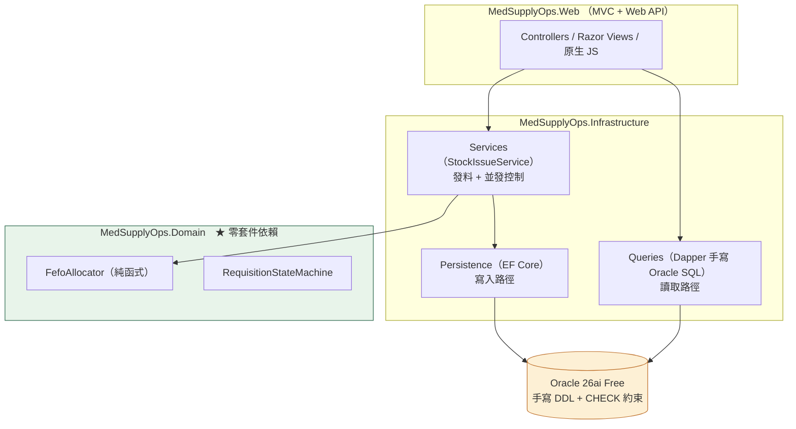
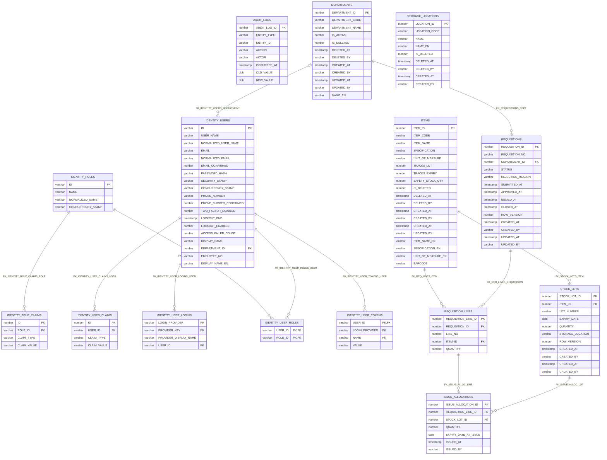
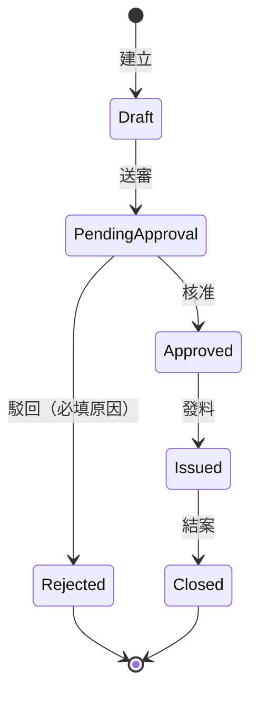
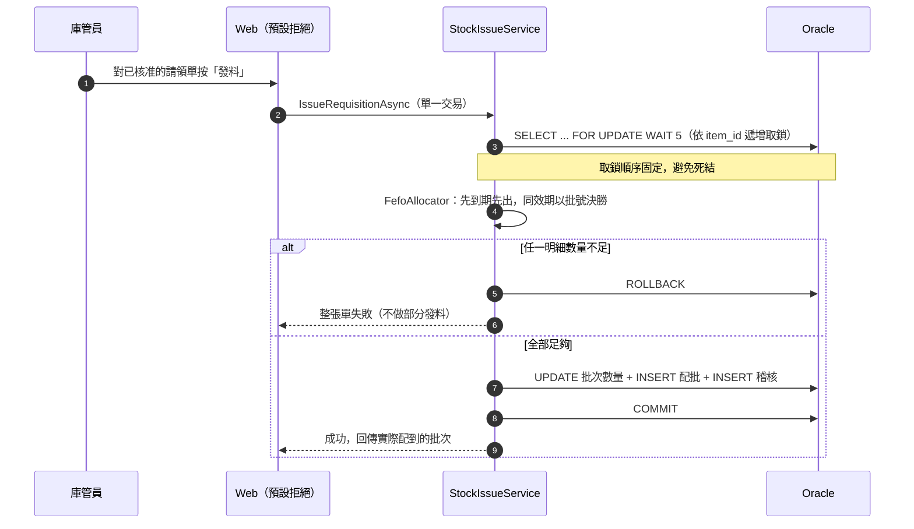

# MedSupplyOps

醫材耗材的**請領與庫存管理系統**。C# / ASP.NET Core MVC + Web API / Oracle。

三種角色（請領人、庫管員、管理員）、14 張資料表、FEFO 先到期先出自動配批、
只增不改不刪的稽核軌跡。介面支援繁體中文與英文、亮色／暗色／高對比主題。

---

## 這個系統做什麼

醫院的醫材耗材（注射針、紗布、導管這類）從入庫到發出去，中間要回答三個問題：
**現在還有多少、哪一批快過期、這批是誰領走的。**

這個系統處理的就是這條線：

```
入庫（批號 + 效期）→ 庫存查詢／效期預警 → 科室建立請領單 → 審核 → 發料（FEFO 自動配批）→ 稽核軌跡
```

三種角色看到的東西不一樣：

| 角色 | 能做什麼 | 看得到誰的資料 |
|---|---|---|
| **請領人** Requester | 建立與送審自己科室的請領單、查看狀態與駁回原因 | **只有自己的科室**（資料庫查詢層過濾，不是畫面藏起來） |
| **庫管員** Storekeeper | 入庫、庫存查詢、效期預警、審核／駁回、發料 | 全院 |
| **管理員** Administrator | 庫管員的全部，加上品項主檔與使用者管理 | 全院 |

系統採**預設拒絕**：沒有明確標註授權政策的端點一律拒絕，而不是一律放行。

**這個系統完全不處理病人資料** —— 沒有病歷、醫囑、掛號、健保申報。
那些需要臨床領域知識，寧可不做，也不做一個看起來對但其實錯的東西。

---

## 怎麼跑起來

需要 **.NET SDK 10** 與 **Docker Desktop**。不需要安裝 Oracle。

```bash
cp .env.example .env        # 填入資料庫密碼
docker compose up -d        # 起 Oracle 26ai Free，自動建 schema 與種子資料
docker compose logs -f oracle   # 等 "DONE: Executing user defined scripts"（它在 "DATABASE IS READY TO USE!" 之後）
dotnet test MedSupplyOps.slnx
```

資料庫在 `//localhost:1521/FREEPDB1`，應用帳號 `MEDSUPPLY`
（**權限最小化**：只有 `CREATE SESSION/TABLE/SEQUENCE/VIEW/PROCEDURE`，
不是 DBA 也不是 SYSTEM。SYS 密碼只存在於容器環境變數，應用程式全程不使用）。

連接埠綁 `127.0.0.1` 而非 Docker 預設的 `0.0.0.0` ——
Docker 會直接改寫 iptables/WinNAT，Windows 防火牆規則擋不住它，
用預設寫法等於把開發資料庫開放給整個區域網路。

### 示範帳號

`dotnet run` 啟動時會自動建立三個角色與各一個示範帳號（冪等，重複啟動不會重複建立）。
密碼相同是刻意的：這是示範帳號，用同一組好記的密碼換取「clone 下來就能登入看畫面」，
不是正式帳號的密碼政策。

| 角色 | 帳號 | 密碼 | 看得到的範圍 |
|---|---|---|---|
| Requester（申請人） | `requester@example.local` | `Demo#2026pass` | 只有自己的科室：急診（`DEP-ER`） |
| Storekeeper（庫管員） | `keeper@example.local` | `Demo#2026pass` | 全院 |
| Administrator（管理員） | `admin@example.local` | `Demo#2026pass` | 全院 |

系統採**預設拒絕**：未登入時只開放登入頁、註冊頁與 FHIR 能力宣告（`/fhir/metadata`），
其他頁面一律導向登入頁，API 回 401。

---

---

## 使用操作

登入後的首頁會依角色顯示不同的工作儀表板 —— 它是工作起點，不是介紹頁。

### 請領人

1. **首頁**：自己科室的請領單狀態一覽；被駁回的單會直接顯示駁回原因。
2. **請領單 → 建立**：選品項、填數量。
   選好品項後畫面會即時顯示**目前可用量與最早效期**；
   可用量不足時仍可送出（庫存隨時在變），但**伺服器會在發料當下重新驗算**，
   畫面上的數字只是參考，不是承諾。
3. 送審後狀態變成「待審核」，接下來由庫管員處理。

### 庫管員

1. **首頁營運儀表板**：待審核、待發料、30 天內到期、低於安全存量、已過期仍在庫，
   加上「今日待發料佇列」與最近異動。每張卡片都可以點進對應清單。
2. **入庫**：選品項、輸入批號、效期與數量，並從啟用中的主檔選擇儲藏位置。
   也可以直接用掃描槍掃條碼（掃描槍就是鍵盤，掃完會自動送出）：一般條碼帶出品項；
   GS1 條碼另外帶出批號與效期，並標示「來自條碼」，人工仍可覆寫。
   **解析不出來就明確拒絕，不猜**——醫材的效期錯了，FEFO 就會把過期品排到前面。
   同一品項的並發入庫會被序列化，新批次立即參與 FEFO。
3. **庫存查詢／效期預警**：依品項展開批次明細；效期預警可調天數。
4. **請領單 → 詳情**：核准或駁回。**駁回一定要填原因**，沒填不讓送出。
5. **發料**：對已核准的單按發料，系統以 FEFO 自動配批並寫入配批明細。
   任何一行數量不足，**整張單失敗並回滾**，不做部分發料。
6. **品項管理**：清單、新增與編輯品項（含條碼）；可開啟 Code 128 大圖供掃描與列印。
7. **儲藏位置管理**：清單、新增與修改英文名稱；停用由管理員執行。

### 管理員

除了上述，管理員另有破壞性操作與使用者後台：

- **停用品項**：只有管理員可執行；日常維護與破壞性操作分離。料號會正規化；料號與單位建立後不可改；
  停用前會檢查是否還有庫存或未結案的請領單。
- **使用者管理**：新增、編輯（姓名／角色／科室）、停用／啟用、重設密碼。
  Email 建立後不可修改（它同時是登入帳號與稽核軌跡裡的身分）。
  重設後的新密碼**只顯示一次**，而且不會寫進稽核紀錄。
  系統**保證至少保留一位啟用中的管理員**，也不允許管理員停用或降級自己 —— 這些都在伺服器端擋。

### 全站偏好

右上角齒輪可切換：**語言**（繁體中文／English）、**顯示時區**（9 個）、
**主題**（明亮／暗色／跟隨系統／高對比）、**表格密度**、**導覽版面**（頂列／側欄）。

顯示時區只影響畫面上的時間呈現。**業務規則的「今天」固定用台北時間**——
效期判定與請領單號的日期不會因為誰把時區調成紐約就跟著變。

---

## 系統架構




**依賴方向只有一個**：Web → Infrastructure → Domain。
Domain 不知道資料庫存在，所以它的規則能被獨立驗證。

資料模型的 ER 圖：[`docs/diagrams/schema.mmd`](docs/diagrams/schema.mmd)（由腳本從資料字典產生）。

---

## 資料庫結構

Schema 是**手寫 DDL**（不是 EF Core migration 產生的），放在 `db/migrations`，
由容器啟動時依序套用，版本記錄在 `SCHEMA_VERSIONS`（該表不屬於資料模型，不進 ER 圖）。

### 業務資料表（8 張）

| 資料表 | 職責 |
|---|---|
| `DEPARTMENTS` | 科室主檔。同時是請領單的歸屬，以及請領人列級授權的範圍依據 |
| `ITEMS` | 品項主檔：料號、品名、規格、單位、安全存量。軟刪除（停用） |
| `STORAGE_LOCATIONS` | 儲藏位置主檔：唯一 ASCII 代碼、原文／英文名稱、軟刪除狀態 |
| `STOCK_LOTS` | 庫存批次：批號、效期、數量、儲藏位置。**FEFO 配批的來源** |
| `REQUISITIONS` | 請領單主檔：單號、科室、狀態、駁回原因、各階段時間戳 |
| `REQUISITION_LINES` | 請領單明細：品項與數量。**拆成明細表才做得到整張單的原子發料** |
| `ISSUE_ALLOCATIONS` | 發料配批：哪一行、從哪一批、扣了多少。配批結果可逐筆追溯 |
| `AUDIT_LOGS` | 稽核軌跡。**只增不改不刪**，由資料庫層的約束保證，不是靠應用程式自律 |

### 身分資料表（7 張）

`IDENTITY_USERS`、`IDENTITY_ROLES`、`IDENTITY_USER_ROLES`、`IDENTITY_USER_CLAIMS`、
`IDENTITY_ROLE_CLAIMS`、`IDENTITY_USER_LOGINS`、`IDENTITY_USER_TOKENS` ——
ASP.NET Core Identity 的標準結構，同樣手寫 DDL。
`IDENTITY_USERS` 多一個 `DEPARTMENT_ID` 欄位，那是請領人列級授權的依據。

### 幾個關鍵的資料模型決策


| 常見做法 | 本系統的決策與理由 |
|---|---|
| 請領單直接掛**單一品項** → 一張單只能一個品項 | 拆出 `RequisitionLine` 明細表。這是**資料模型層級的決策**，不是附加功能 —— 否則做不到整張單的原子發料 |
| 用 **`ON DELETE CASCADE`** 把明細掛在主檔下 | 全面軟刪除 + 限制刪除，**全 schema 零 CASCADE**。CASCADE 在醫療場域等同銷毀稽核軌跡 |
| 密碼用**無 salt 的雜湊**，或在 SQL 內計算雜湊 | ASP.NET Core Identity（PBKDF2 + 每帳號 salt）；明文不進 SQL、也不進資料庫日誌 |
| 變更狀態的表單**沒有 CSRF token** | 一律啟用 AntiForgery Token |
| 使用者輸入**未編碼就輸出** | Razor 自動編碼；`Html.Raw` 需個案說明理由 |
| 登入前後**沿用同一個 Session 識別碼** | 登入成功後重新產生識別碼（防 session fixation） |
| 有軟刪除欄位，但**實際仍是硬刪** | 落實軟刪除 + 函數式唯一索引（只有未刪除的資料需要唯一） |
| 用數字參數的 switch 當路由（`?act=100`） | MVC 慣例路由 + 具名 Action。**路由就是權限邊界** |
| 授權**預設公開**，需要保護的才標註 | **預設拒絕**（fallback policy）+ 公開端點白名單。預設公開的漏標永遠不會被發現 |

每一項的完整理由見 [`docs/requirements.md`](docs/requirements.md) §4 與 §7。

---

## 關聯綱目

<!-- ER-DIAGRAM:BEGIN 本區塊由 scripts/generate-er-diagram.ps1 從 Oracle 資料字典產生，請勿手動編輯 -->

<!-- ER-DIAGRAM:END -->

`STORAGE_LOCATIONS` 在圖中刻意是沒有關聯線的獨立表：本階段以名稱 `LEFT JOIN` 顯示雙語名稱，
但 `STOCK_LOTS.STORAGE_LOCATION` 仍保留文字欄位且不加外鍵；後續若要改外鍵，須先清理歷史資料並改寫測試。

這張圖**不是手畫的**，也不是畫一次就放著：
它由 `scripts/generate-er-diagram.ps1` 從 Oracle 的資料字典（`user_tables` / `user_tab_columns` /
`user_constraints`）讀出來產生，而 `-Check` 模式是提交前必跑的關卡之一。
**schema 與這張圖一旦脫節，建置就會紅**，訊息會指名是哪張表、哪個欄位、哪條關係對不上 ——
包含你正在看的這一份。文件不會偷偷過期。

同一份內容也存成 [`docs/diagrams/schema.mmd`](docs/diagrams/schema.mmd)。

---

## 序列圖

### 請領單的狀態機

狀態轉換是**明列**的，不是散在各處的 if／switch。明列之後，測試才能窮舉
（狀態 × 動作）的完整組合，斷言「恰好這五條成立、其餘全部被拒絕」。



不合法的轉換一律回傳失敗並產生明確錯誤，**不得靜默忽略**。

### 發料：從按下按鈕到寫進資料庫



三個值得說明的地方：

- **為什麼用悲觀鎖**：庫存扣帳衝突的代價是「發出去的東西比實際有的多」，
  樂觀鎖的重試在這裡沒有意義 —— 重試完還是要擋。
- **為什麼依 `item_id` 遞增取鎖**：兩張單同時發料且品項交集時，
  取鎖順序不固定就會死結。固定順序是唯一不用靠運氣的解法。
- **為什麼不做部分發料**：半發的請領單在現場等於「這單到底算不算領完了」的爭議，
  而爭議會變成有人手動改資料庫。整張單成功或整張單失敗，沒有中間狀態。

---

## 範圍

**刻意不做**（[`docs/requirements.md`](docs/requirements.md) §6）：
病歷／醫囑／掛號／健保申報（**無臨床領域知識，寧可不做，也不做一個看起來對但錯的東西**）、
對外採購與驗收、多院區調撥、前端 SPA、高可用叢集。

> 系統內出現的所有機構、科室與人名皆為虛構或通用職能名詞，
> 不指向任何真實醫療院所（`docs/requirements.md` OUT-7）。

---

## 延伸閱讀

| 文件 | 內容 |
|---|---|
| [`docs/requirements.md`](docs/requirements.md) | 需求規格與追溯表（每條需求有 ID、狀態與可定位的證據） |
| [`docs/engineering.md`](docs/engineering.md) | 工程與驗證方法：六道關卡、鑑別力探針、效能量測方式 |
| [`docs/diagrams/schema.mmd`](docs/diagrams/schema.mmd) | 由資料字典產生的 ER 圖 |
| [`docs/integration/fhir.md`](docs/integration/fhir.md) | HL7 FHIR R4 唯讀介接 |
| [`docs/operations/backup-restore.md`](docs/operations/backup-restore.md) | 備份與還原演練 |
| [`docs/operations/cold-start-verification.md`](docs/operations/cold-start-verification.md) | 乾淨環境冷啟的完整重演紀錄 |
